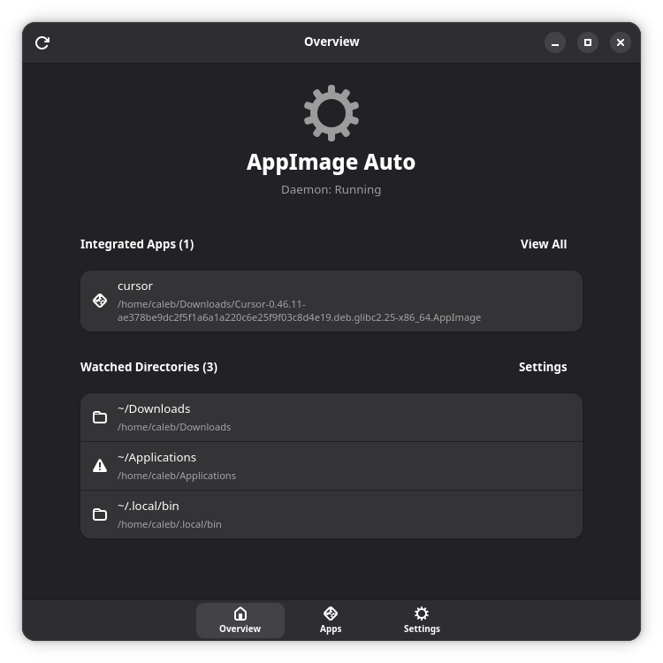

# appimage-auto

A minimal, focused Rust daemon that automatically integrates AppImages into the Linux desktop menu.

## Why?

Existing solutions have issues for me:

| Tool | Problem |
|------|---------|
| **go-appimaged** | Large surface area with extra features I don't need (Zeroconf, PubSub, P2P/IPFS, Firejail) |
| **AppImageLauncher** | Unmaintained since 2020, crashes on modern distros, uses problematic LD_PRELOAD |
| **Gear Lever** | Manual only, requires drag-and-drop |

Realistically, You probably want to use `go-appimaged`.
It is a "big" project with a larger team and more features.
I just want something that:
- notices I downloaded an AppImage,
- makes it executable,
- creates a .desktop file with the correct path and icon.
- *bonus* watches for moves and deletions to keep the desktop file updated.

**appimage-auto** does one thing well: watch directories and automatically integrate AppImages into your desktop menu.



You can just download a new AppImage and it will get integrated into your desktop automatically.
If you delete the AppImage, it will be removed. Simple.

## Features

- **Automatic Integration**: Detects new AppImages and creates menu entries
- **Magic Byte Validation**: Verifies ELF + AppImage signatures (not just file extensions)
- **Icon Extraction**: Installs icons to the correct hicolor theme directories
- **Move Tracking**: Updates menu entries when AppImages are moved within watched directories
- **Cleanup**: Removes menu entries when AppImages are deleted
- **Startup Scan**: Integrates existing AppImages when the daemon starts
- **Desktop Notifications**: Optional notifications when apps are integrated or removed
- **GUI Settings App**: GTK4/Adwaita settings application for managing integrations and configuration
- **Desktop Agnostic**: Uses freedesktop.org standards (works with GNOME, KDE, XFCE, etc.)

## Installation

Everything installs to your user home directory — no root access or system-level changes required.
Even the background daemon runs as a systemd user service.

### Quick Install

1. Download the latest `appimage-auto-*-x86_64-linux.zip` from [GitHub Releases](https://github.com/cjrh/appimage-auto/releases)
2. Extract and run the installer:

```bash
unzip appimage-auto-*-x86_64-linux.zip
cd appimage-auto
./install.sh
```

That's it. The installer:
- Places binaries in `~/.local/bin/`
- Installs and starts a systemd user service
- Installs the GUI desktop entry (if included in the bundle)
- Creates a default config at `~/.config/appimage-auto/config.toml` (preserves any existing config)
- Warns you if `~/.local/bin` is not in your `$PATH`

### Verify It's Running

```bash
systemctl --user status appimage-auto
```

### Uninstalling

The bundle includes an uninstall script:

```bash
cd appimage-auto
./uninstall.sh
```

You'll be asked whether to also remove configuration and state data. For non-interactive use:

```bash
./uninstall.sh --remove-data   # remove everything
./uninstall.sh --keep-data     # keep config and state
```

### What Gets Installed

All files live under your home directory:

| File | Purpose |
|------|---------|
| `~/.local/bin/appimage-auto` | CLI and daemon binary |
| `~/.local/bin/appimage-auto-gui` | GUI settings app (optional) |
| `~/.local/share/systemd/user/appimage-auto.service` | Systemd user service |
| `~/.local/share/applications/appimage-auto-gui.desktop` | GUI desktop entry (optional) |
| `~/.local/share/icons/hicolor/256x256/apps/appimage-auto.png` | App icon |
| `~/.config/appimage-auto/config.toml` | Configuration |
| `~/.local/share/appimage-auto/state.json` | Integration state (created at runtime) |

### Building from Source

Requires Rust 1.70+ and Linux.

```bash
git clone https://github.com/youruser/appimage-auto
cd appimage-auto
cargo build --release
```

For the GUI, you also need GTK4 and libadwaita development libraries:

```bash
# Fedora
sudo dnf install gtk4-devel libadwaita-devel

# Ubuntu/Debian
sudo apt install libgtk-4-dev libadwaita-1-dev

# Arch
sudo pacman -S gtk4 libadwaita
```

```bash
cargo build --release --features gui
```

To build a release bundle zip:

```bash
just bundle
```

## Usage

### CLI Commands

```bash
# Run daemon in foreground (for testing)
appimage-auto daemon

# One-shot scan (integrate existing, cleanup orphaned, exit)
appimage-auto scan

# Show status and statistics
appimage-auto status

# List all integrated AppImages
appimage-auto list

# Manually integrate a specific AppImage
appimage-auto integrate ~/Downloads/SomeApp.AppImage

# Remove integration for an AppImage
appimage-auto remove ~/Downloads/SomeApp.AppImage

# View current configuration
appimage-auto config show

# Add a watch directory
appimage-auto config add-watch ~/Apps

# Remove a watch directory
appimage-auto config remove-watch ~/Apps

# Verbose output (-v, -vv, -vvv)
appimage-auto -vv daemon
```

### GUI Settings App

Launch from your application menu or run:

```bash
appimage-auto-gui
```

The GUI provides:
- **Overview**: Daemon status, list of integrated apps and watched directories
- **Apps**: Manage integrated AppImages — remove integrations or open file locations
- **Settings**: Add/remove watch directories, configure notifications, adjust daemon settings, enable/disable autostart

### Configuration

Configuration is stored at `~/.config/appimage-auto/config.toml`:

```toml
[watch]
# Directories to monitor for AppImages
directories = [
    "~/Downloads",
    "~/Applications",
    "~/.local/bin",
]

# File patterns (in addition to magic byte detection)
patterns = ["*.AppImage", "*.appimage"]

# Debounce delay in milliseconds
debounce_ms = 1000

[integration]
# Where to install .desktop files
desktop_dir = "~/.local/share/applications"

# Where to install icons
icon_dir = "~/.local/share/icons/hicolor"

# Run update-desktop-database after changes
update_database = true

# Scan for existing AppImages on startup
scan_on_startup = true

[logging]
level = "info"  # trace, debug, info, warn, error

[notifications]
# Enable desktop notifications
enabled = true

# Notify when an AppImage is integrated
on_integrate = true

# Notify when an AppImage is removed
on_unintegrate = true
```

### Service Management

```bash
# Start/stop/restart
systemctl --user start appimage-auto
systemctl --user stop appimage-auto
systemctl --user restart appimage-auto

# View logs
journalctl --user -u appimage-auto -f

# Disable autostart
systemctl --user disable appimage-auto
```

## How It Works

### Detection

1. Monitors configured directories using inotify
2. When a file appears, checks for AppImage magic bytes:
   - ELF header: `0x7F 'E' 'L' 'F'`
   - AppImage signature at offset 8: `'A' 'I' 0x01` (Type 1) or `'A' 'I' 0x02` (Type 2)
3. Validates completeness by checking the SquashFS superblock before integrating

### Integration

1. Makes the AppImage executable (`chmod +x`)
2. Extracts metadata using `--appimage-extract`
3. Parses the embedded `.desktop` file
4. Modifies `Exec=` to point to the actual AppImage path
5. Adds tracking identifier (`X-AppImage-Identifier`)
6. Installs icons to `~/.local/share/icons/hicolor/<size>/apps/`
7. Writes `.desktop` file to `~/.local/share/applications/`
8. Runs `update-desktop-database`

## Troubleshooting

### AppImage not appearing in menu

1. Check if it's a valid AppImage: `appimage-auto integrate /path/to/app.AppImage -v`
2. Verify the AppImage has an embedded `.desktop` file
3. Check logs: `journalctl --user -u appimage-auto`

### Menu entry not updating after move

The daemon only tracks moves within watched directories. Moving an AppImage to an unwatched location will remove its integration.

### Icons not showing

Some AppImages don't include icons. The integration will still work, but without a custom icon.

## License

MIT
